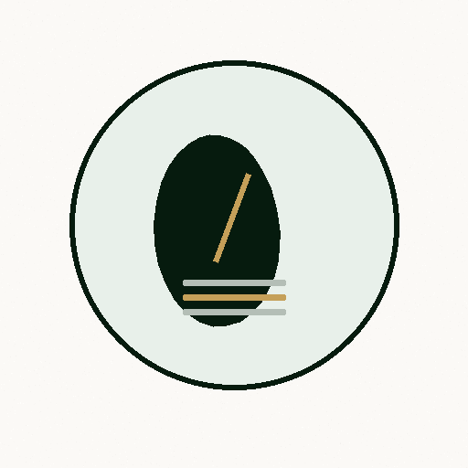
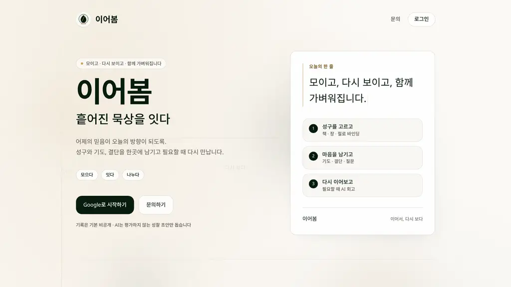
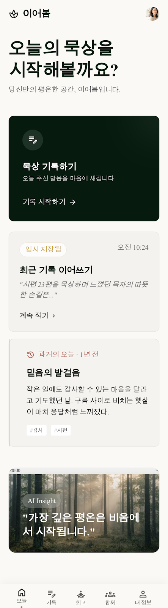
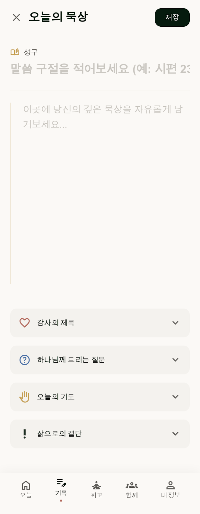
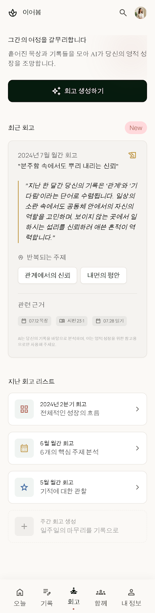
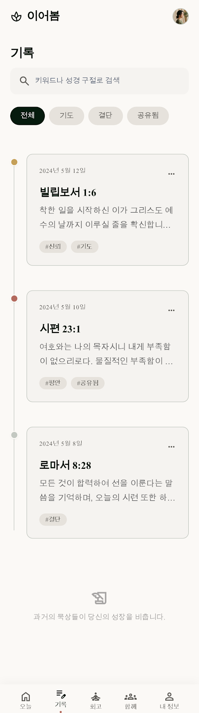
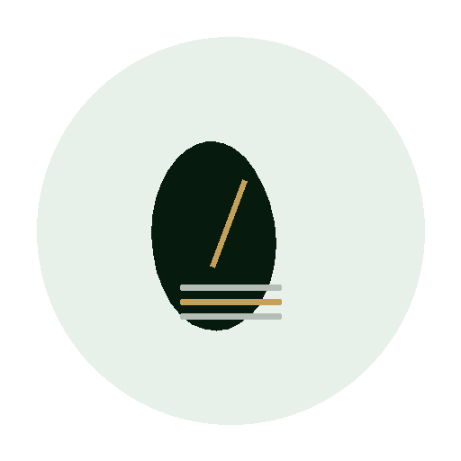

<p align="center">
  
</p>

<h1 align="center">이어봄</h1>

<p align="center">
  <strong>흩어진 묵상을 이어, 어제의 믿음이 오늘의 방향이 되게 합니다.</strong>
</p>

<p align="center">
  모이고 · 다시 보이고 · 함께 가벼워집니다
</p>

<p align="center">
  <a href="https://eobom.ponslink.com"></a>
  
  
  
  
  
</p>

---

## 이어봄이란

> AI는 판정하지 않고, 기록이 스스로 말하게 돕는다.

이어봄은 성경 묵상을 **대신 써 주는 AI 앱이 아닙니다.**
이미 남긴 성구·생각·기도·결단을 안전하게 쌓고, 흐름을 다시 연결해 주는 **개인 신앙 기록 공간**입니다.

| 원칙 | 설명 |
|:---|:---|
| 🌿 **모으다** | 성구·기도·결단을 한 기록지에 |
| 🔗 **잇다** | AI 회고는 거울 — 점수·판단 없음 |
| 🤝 **나누다** | 원할 때만 익명 한 문장 (`함께`) |
| 🔒 **원문 비공개** | 개인 묵상 원문은 기본 비공개 |

---

## 미리보기

<p align="center">
  
</p>

<p align="center">
  
  &nbsp;&nbsp;
  
  &nbsp;&nbsp;
  
  &nbsp;&nbsp;
  
</p>

<p align="center">
  <sub>오늘 · 기록 · AI 회고 · 함께</sub>
</p>

---

## 주요 기능

### 📖 오늘의 묵상
성경 본문을 선택하고(책·장·절) 오늘의 묵상을 기록합니다.
감사의 제목, 하나님께 드리는 질문, 기도, 삶으로의 결단까지 — 하나의 기록지에 담습니다.

### 📚 기록함
지난 묵상을 날짜·성구·태그로 검색하고 다시 읽습니다.
과거의 기록이 쌓일수록 당신의 성장이 보입니다.

### ✨ AI 회고
기간별 흐름을 AI가 분석하여 테마·감정·결단을 근거와 함께 정리합니다.
- 모든 관찰에는 **근거 기록**이 연결됩니다
- **반복되는 주제**가 한눈에 보입니다
- AI는 거울일 뿐, **판단하지 않습니다**

> 설정에서 외부 생성(AI) 동의가 필요합니다.

### 📖 다시 읽을 말씀
기록에 등장한 성경 본문을 처방 없이 다시 연결해 줍니다.
 회고나 오늘 홈에서 바로 접근할 수 있습니다.

### 🤝 함께
익명으로 나누고 싶은 한 문장을 남깁니다.
AI 주제 태그가 자동으로 붙고, 같은 마음을 가진 기록을 발견할 수 있습니다.

### 🪞 이야기 거울
기록과 닿아 있는 고전·성경 속 이야기를 연결합니다.
- **이야기** — 닮은 인물과 작품
- **연결** — 지금의 마음과 닿는 장면
- **시각화** — 이야기 구조를 조용히 그려줍니다

---

## 기술 스택

| 계층 | 기술 |
|:---|:---|
| **프레임워크** | Next.js 16 (App Router, Turbopack) |
| **UI** | React 19, Tailwind CSS v4, shadcn/ui |
| **인증** | NextAuth.js (Google OAuth) |
| **데이터** | Prisma + SQLite |
| **AI** | MiMo (`mimo-v2.5`) — 회고·주제 태그 |
| **런타임** | Bun |
| **배포** | systemd + nginx (Cloudflare) |

---

## 빠른 시작

```bash
# 1. 의존성 설치
bun install

# 2. 환경 변수 설정
cp .env.example .env
# GOOGLE_CLIENT_ID, GOOGLE_CLIENT_SECRET, NEXTAUTH_SECRET, MIMO_API_KEY 등 입력

# 3. 데이터베이스 스키마 반영
bun run db:push

# 4. 개발 서버 시작
bun run dev
```

로컬에서 확인: [http://localhost:3100](http://localhost:3100)

### Google OAuth 콜백 설정

| 환경 | Redirect URI |
|:---|:---|
| 로컬 | `http://localhost:3100/api/auth/callback/google` |
| 운영 | `https://eobom.ponslink.com/api/auth/callback/google` |

필수 환경 변수는 [`.env.example`](.env.example)을 참고하세요.

---

## 명령어

| 명령 | 설명 |
|:---|:---|
| `bun run dev` | 개발 서버 (포트 3100) |
| `bun run build` | 프로덕션 빌드 |
| `bun run start` | 프로덕션 서버 실행 |
| `bun run test` | 단위 테스트 (DB 불필요) |
| `bun run db:push` | Prisma 스키마 반영 |
| `bun run db:generate` | Prisma 클라이언트 생성 |
| `bun run lint` | ESLint 검사 |

---

## 앱 구조

```
/                  랜딩 — 이어봄 소개
/login             Google 로그인
/today             오늘 홈 — 묵상 시작
/entries           기록함 — 지난 묵상 검색
/entries/new       새 묵상 기록
/reviews           AI 회고 — 기간별 성찰
/reviews/[id]      회고 상세 — 근거·주제·다음 단계
/together          함께 — 익명 나눔
/story-mirror      이야기 거울 — 고전·성경 연결
/me                내 정보 · QR 키링 · 내보내기
/j/[slug]          개인 키링 입구
/contact           문의
```

---

## 프로젝트 구조

```
src/
├── app/                  # Next.js App Router 페이지
│   ├── today/            # 오늘 홈
│   ├── entries/          # 기록함 + 새 기록
│   ├── reviews/          # AI 회고
│   ├── together/         # 익명 나눔
│   ├── story-mirror/     # 이야기 거울
│   ├── me/               # 내 정보
│   └── api/              # API 라우트
├── components/           # 공유 컴포넌트
│   ├── app-shell.tsx     # 네비게이션 쉘
│   ├── review/           # 회고 관련 컴포넌트
│   ├── scripture/        # 성경 선택 컴포넌트
│   └── ui/               # shadcn/ui 기본
├── lib/                  # 유틸리티
│   ├── auth.ts           # NextAuth 설정
│   ├── db.ts             # Prisma 클라이언트
│   ├── session.ts        # 세션 관리
│   ├── actions.ts        # 서버 액션
│   ├── mimo.ts           # AI 연동
│   └── story-mirror/     # 이야기 거울 로직
└── prisma/               # DB 스키마
```

---

## 배포

프로덕션: **[eobom.ponslink.com](https://eobom.ponslink.com)**

```bash
./deploy/deploy.sh          # 릴리스 서버에서 실행
./deploy/deploy.sh --remote # 로컬에서 rsync 배포
```

- `deploy/eobom.service` — systemd 서비스 설정
- `deploy/nginx-eobom.conf` — nginx 프록시 설정

### 운영 메모

- **헬스체크** — `GET /api/health` (생존), `GET /api/health?db=1` (SQLite 연결 확인)
- **Rate limit** — 프로세스 메모리 슬라이딩 윈도우 (단일 인스턴스)
- **테스트** — `bun run test` (단위), DB 테스트는 별도

---

## 설계 원칙

> **기록은 기본적으로 나만 봅니다.**
> AI는 신앙을 평가하지 않습니다.
> 기록은 기본적으로 비공개 · AI는 점수·판단 없음 · 원문은 공개되지 않음

- 점수, 뱃지, 게이미피케이션 없음
- AI 대시보드 미학 대신 에세이·편지 느낌
- 빈 섹션은 숨기고, 있는 것만 보여줌
- `prefers-reduced-motion` 지원

---

## 라이선스

이 프로젝트는 현재 비공개입니다. 사용이나 기여에 대해서는 [문의](https://eobom.ponslink.com/contact)해 주세요.

---

<p align="center">
  
  <br />
  <sub>© PonsLink · <a href="https://eobom.ponslink.com/contact">문의</a></sub>
</p>
