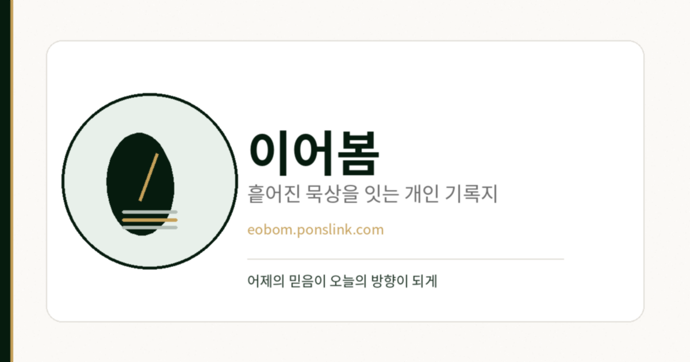

<p align="center">
  
</p>

<h1 align="center">이어봄</h1>

<p align="center">
  <strong>흩어진 묵상을 이어, 어제의 믿음이 오늘의 방향이 되게 합니다.</strong>
</p>
<p align="center">
  모이고, 다시 보이고, 함께 가벼워집니다.
</p>

<p align="center">
  개인 묵상·큐티 기록 · AI 성찰 회고 · 익명 나눔
</p>

<p align="center">
  <a href="https://eobom.ponslink.com"></a>
  
  
  
</p>

<p align="center">
  
</p>

---

## 소개

이어봄은 성경 묵상을 **대신 써 주는 AI 앱이 아닙니다.**  
이미 남긴 성구·생각·기도·결단을 안전하게 쌓고, 흐름을 다시 연결해 주는 **개인 신앙 기록 공간**입니다.

| 원칙 | 설명 |
|:---|:---|
| 모으다 | 성구·기도·결단을 한 기록지에 |
| 잇다 | AI 회고는 거울 — 점수·판정 없음 |
| 나누다 | 원할 때만 익명 한 문장 (`함께`) |
| 원문 비공개 | 개인 묵상 원문은 기본 비공개 |

## 주요 기능

- **오늘의 묵상** — 성구 선택(책·장·절), 본문 미리보기, 자유 기록
- **기록함** — 날짜·성구·태그로 지난 묵상 다시 읽기
- **AI 회고** — 기간별 테마·감정·결단 흐름을 근거와 함께 정리 (설정에서 외부 처리 허용 필요)
- **다시 머물 본문** — 회고·오늘 홈에서 기록에 등장한 말씀을 처방 없이 다시 연결
- **함께** — 익명 나눔, 성구 선택, AI 주제 태그, 공감·기도 반응
- **내 기록지** — QR 키링 입구(`/j/{slug}`), 설정·내보내기

## 미리보기

<p align="center">
  
  &nbsp;
  
  &nbsp;
  
  &nbsp;
  
</p>

<p align="center">
  <sub>오늘 · 기록 · 함께 · AI 회고</sub>
</p>

## 스택

- **App** — Next.js 16, React 19, TypeScript, Tailwind CSS, shadcn/ui
- **Auth** — NextAuth (Google OAuth)
- **Data** — Prisma + SQLite
- **AI** — MiMo (`mimo-v2.5-pro`) 회고·주제 태그
- **Runtime** — Bun

## 시작하기

```bash
bun install
cp .env.example .env
# GOOGLE_CLIENT_ID / SECRET, NEXTAUTH_SECRET, MIMO_API_KEY 등 입력
bun run db:push
bun run dev
```

로컬: [http://localhost:3100](http://localhost:3100)

### Google OAuth 콜백

| 환경 | Redirect URI |
|:---|:---|
| 로컬 | `http://localhost:3100/api/auth/callback/google` |
| 운영 | `https://eobom.ponslink.com/api/auth/callback/google` |

필수 환경 변수는 [`.env.example`](.env.example)을 참고하세요.

### 스크립트

| 명령 | 설명 |
|:---|:---|
| `bun run dev` | 개발 서버 (3100) |
| `bun run build` | 프로덕션 빌드 |
| `bun run test` / `test:unit` | DB 없는 단위 테스트 |
| `bun run test:seats` | seats DB 테스트 |
| `bun run db:push` | 스키마 반영 |
| `./deploy/deploy.sh` | 운영 배포 |

## 앱 구조

```text
/                랜딩
/login           Google 로그인
/today           오늘 홈
/entries         묵상 기록
/reviews         AI 회고
/together        익명 나눔
/me              내 정보 · QR · 내보내기
/j/[slug]        개인 키링 입구
/contact         문의
```

## 운영 메모

- **헬스체크** — `GET /api/health` (생존), `GET /api/health?db=1` (SQLite 핑, 실패 시 503)
- **Rate limit** — 프로세스 메모리 슬라이딩 윈도우(단일 인스턴스 전제). 스케일 아웃 시 공유 스토어 필요
- **테스트** — `bun run test:unit` (DB 불필요), `bun run test:seats` (SQLite 파일 필요)
- **아카이브** — 과거 Stitch 시안은 `docs/archive/`
- **후속** — 기도 주제 UI 등은 `docs/deferred/`

## 배포

프로덕션: **[eobom.ponslink.com](https://eobom.ponslink.com)**

```bash
./deploy/deploy.sh
```

`deploy/eobom.service`, `deploy/nginx-eobom.conf`에 systemd·nginx 설정이 있습니다.

## 설계 원칙 (한 줄)

> AI는 판정하지 않고, 기록이 스스로 말하게 돕는다.

---

<p align="center">
  
  <br />
  <sub>© PonsLink · <a href="https://eobom.ponslink.com/contact">문의</a></sub>
</p>
