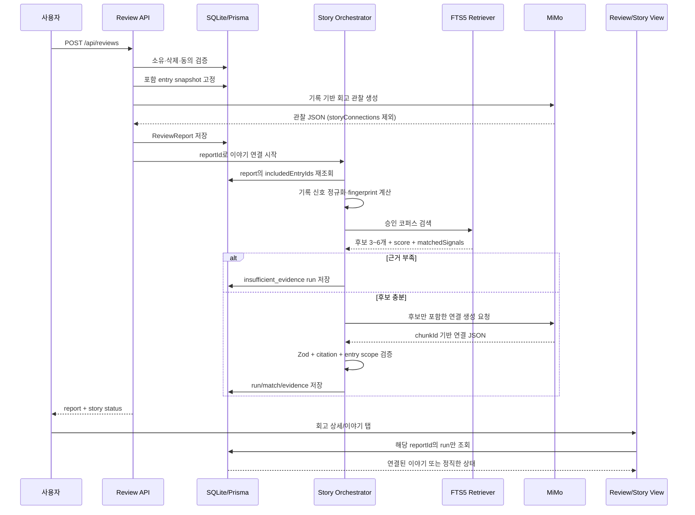

# 기록 기반 회고·이야기 연결 설계 v1

- 작성일: 2026-08-01
- 상태: 구현 전 승인용 설계 계약
- 범위: 회고 생성, 이야기 거울 연결, 관련 화면·저장·실패·검증
- 상위 제품 설계: [`DESIGN.md`](../../DESIGN.md)
- 기존 RAG 설계: [`story-mirror-rag-v4.md`](./story-mirror-rag-v4.md)

> 이 문서는 “사용자의 기록에 따라 회고와 이야기가 그 기록에 맞게 제공된다”는 제품 계약을 구현자가 임의로 축소하거나 우회하지 않도록 고정한다.

---

## 0. 결정 요약

### 0.1 최종 결정

이야기 연결의 단일 진실 원천은 **현재 사용자가 생성한 특정 회고에 포함된 기록 집합**이다.

```text
회고 요청
  → 포함할 ReflectionEntry를 서버에서 확정
  → 해당 기록으로 회고 관찰 생성
  → 동일한 기록 스냅샷으로 이야기 검색 질의 생성
  → 승인된 StoryChunk만 검색 후보로 채택
  → 후보에 포함된 이야기만 MiMo가 선택·설명
  → chunkId와 entryId를 검증한 뒤 저장
  → 해당 ReviewReport에 연결된 StoryRagRun만 화면에 표시
```

다음은 허용하지 않는다.

- `탕자`, `하갈` 등 고정된 이야기 이름·본문·연결 문장을 fallback으로 반환하는 것
- 현재 회고와 무관한 사용자의 “최신 이야기 결과”를 회고 상세에 끼워 넣는 것
- 검색 후보에 없던 작품·인물·성구·장면을 모델이 새로 만들어 반환하는 것
- 이야기 연결이 실패했을 때 실패를 감추고 일반적인 이야기를 사용자 맞춤 결과처럼 표시하는 것
- 최신 입력값만으로 전체 기간 회고를 대표하거나, 선택된 기록 밖의 기록을 근거로 사용하는 것

### 0.2 현재 구현에서 확인된 문제

다음은 설계가 아니라 현재 코드·DB를 직접 확인한 사실이다.

| 사실 | 근거 |
|---|---|
| 회고의 MiMo 프롬프트가 `storyConnections`를 직접 생성한다 | `src/lib/mimo.ts`의 `generateReviewWithMimo` |
| MiMo 실패 시 `fallbackReview()`가 `탕자 (누가복음 15)`, `하갈 (창세기 16)`을 고정 반환한다 | `src/lib/mimo.ts`의 `fallbackReview` |
| `getReviewScopedStoryItems()`는 회고 연결 → 최신 RAG → 최신 카드 매칭 순으로 fallback한다 | `src/lib/story-mirror/db.ts` |
| `/story-mirror/reflect`는 실제 RAG 화면이 아니라 `/story-mirror`로 redirect한다 | `src/app/story-mirror/reflect/page.tsx` |
| `StoryMirrorRag`와 `StoryMirrorHomeCard`는 현재 화면에서 import되지 않는다 | `src` 전체 검색 결과 |
| 현 DB의 `StoryRagRun`은 0건이며 `StoryMirrorRun`은 1건이다 | `linkview/db/eobom.db` 확인 결과 |
| 저장된 회고 9건 중 7건이 `local-fallback / heuristic-v1`이며 같은 두 이야기를 반환한다 | `ReviewReport.structuredOutput`, `modelProvider`, `modelName` 확인 결과 |
| StoryChunk 160개와 FTS5 인덱스는 존재하며, 회고 seed로 검색 결과가 반환된다 | `StoryChunk`, `StoryChunkFts` 확인 결과 |

### 0.3 설계 목표

1. **기록 적합성**: 이야기 후보와 연결 문장 모두 선택된 기록에서 추적 가능해야 한다.
2. **근거성**: 모든 이야기 연결은 승인된 `StoryChunk`와 하나 이상의 `ReflectionEntry`를 가져야 한다.
3. **정직한 부재**: 충분한 근거가 없으면 이야기를 만들지 않고 비어 있는 상태를 표시한다.
4. **회고 독립성**: 이야기 생성 실패가 회고 전체 실패로 이어지지 않는다.
5. **재현성**: 같은 기록 스냅샷·코퍼스·검색기·프롬프트 정책이면 같은 결과를 재현하거나 동일 run을 재사용한다.
6. **개인정보 보호**: 소유자·동의·기록 범위를 서버에서 검증하고, 로그와 fingerprint에 원문을 넣지 않는다.

---

## 1. 용어와 범위

### 1.1 용어

- **기록(entry)**: `ReflectionEntry` 한 건. 본문, 감정, 태그, 질문, 기도, 감사, 결단, 성구를 포함한다.
- **회고(report)**: `ReviewReport` 한 건. 특정 기간과 `includedEntryIds`를 가진다.
- **이야기 작품(work)**: `StoryWork`. 작품·인물·출처·권리·문화권의 상위 메타데이터다.
- **이야기 청크(chunk)**: `StoryChunk`. 검색과 연결의 최소 근거 단위다.
- **이야기 run**: 특정 회고 기록 스냅샷으로 검색·생성·저장한 `StoryRagRun` 한 건.
- **이야기 match**: run이 검색한 `StoryChunk`와 생성된 연결 문장을 보관하는 `StoryRagMatch` 한 건.
- **이야기 evidence**: match가 실제로 사용한 기록을 보관하는 `StoryRagEvidence` 한 건.
- **기록 적합성(record-grounded)**: 화면 문장에 등장하는 관찰·유사성·연결이 `entryId`와 `chunkId`로 역추적되는 상태.

### 1.2 범위에 포함

- 회고 생성 시 포함 기록을 고정하는 방식
- 회고 관찰과 이야기 연결의 생성 경계
- StoryChunk 검색 질의·점수·다양성·권리 게이트
- MiMo 후보 제한·응답 검증·실패 처리
- `ReviewReport`와 `StoryRagRun`의 연결
- 회고 상세·이야기 탭의 조회 우선순위
- 동의·개인정보·삭제·권리 철회
- 기존 하드코딩 및 무관 fallback 제거
- 단위·통합·회귀·품질 평가 기준

### 1.3 범위에서 제외

- StoryChunk 원문 수집 방식과 개별 작품의 저작권 판정 자체
- 임베딩 DB, 벡터 검색, 외부 Qdrant 도입
- 이야기 시각화의 이미지 생성 방식
- 함께하면 좋은 사람의 전용 AI 필드 설계
- 회고 UI의 전체 리디자인. 화면은 현재 [`DESIGN.md`](../../DESIGN.md)의 4블록 계약을 따른다.

---

## 2. 불변 제품 계약

구현자는 아래 규칙을 테스트로 고정해야 한다.

### R1. 회고 범위 고정

회고와 이야기 생성은 `ReviewReport.includedEntryIds`에 있는 기록만 사용한다.

- `excludedEntryIds`는 절대 사용하지 않는다.
- 요청 body의 `entryIds`는 소유권과 삭제 여부를 서버에서 다시 확인한다.
- 클라이언트가 보낸 `entryCount`, 기간, 주제, 감정은 신뢰하지 않는다.
- 회고 생성 이후 새로 작성된 기록은 기존 report의 이야기 run에 포함하지 않는다.
- 원본 기록이 삭제되면 해당 evidence와 결과는 cascade 또는 비활성화된다.

### R2. 이야기 후보의 출처 고정

표시 가능한 이야기 후보는 다음 조건을 모두 만족해야 한다.

```text
StoryChunk.rightsStatus = approved
StoryChunk.language = 사용자의 허용 locale과 일치
StoryChunk.corpusVersion = 현재 production corpus version
StoryChunk가 FTS 검색 결과에 포함됨
StoryChunk의 score가 최소 임계값 이상
StoryChunk의 matchedSignals가 기록 질의와 겹침
```

`StoryCard`만 존재하는 이야기는 새 record-grounded RAG 결과가 아니다. 카드 매칭은 호환 경로로 유지할 수 있으나, 회고 상세의 정식 이야기 원천으로 사용하지 않는다.

### R3. 생성 모델의 역할 제한

MiMo는 이야기 후보를 발견하지 않는다. 서버가 먼저 고정한 후보 중에서만 선택하고 연결 문장을 쓴다.

- 허용된 `chunkId`만 출력 가능
- 허용된 `entryId`만 근거로 선택 가능
- 후보에 없는 작품명·인물명·장면·locator·인용 생성 금지
- 후보 원문에 없는 사실을 연결 문장에 추가 금지
- 사용자를 인물의 성격·운명·신앙 상태로 분류 금지
- 하나님의 뜻, 죄, 소명, 예언, 의료·법률·정신건강 결론 금지

### R4. 하드코딩 이야기 금지

새 코드와 새 회고에는 특정 이야기의 제목·본문·연결 문장을 고정 fallback으로 넣지 않는다.

MiMo가 실패했을 때 허용되는 fallback은 둘 중 하나뿐이다.

1. 검색 후보와 기록 신호를 이용한 **결정적이고 일반적인 근거 문장** 생성
2. 이야기 연결을 비우고 `insufficient_evidence` 또는 `generation_failed` 상태 표시

결정적 fallback도 후보의 제목·주제·기록 신호를 런타임에 삽입해야 하며, 특정 작품명을 코드 상수로 포함하지 않는다.

### R5. 회고와 이야기 결과의 결합 방식

`ReviewReport.structuredOutput.storyConnections`는 새 구현의 권위 있는 저장소가 아니다.

- 새 회고 생성 시 `storyConnections`는 빈 배열로 저장하거나 legacy 호환용으로만 유지한다.
- 정식 이야기 결과는 `ReviewReport → StoryRagRun → StoryRagMatch → StoryChunk` 관계로 저장한다.
- 회고 상세는 자기 report에 연결된 run만 읽는다.
- 다른 report의 최신 run, 사용자의 전역 최신 card run을 회고 fallback으로 사용하지 않는다.

### R6. 근거 없는 이야기는 표시하지 않음

후보가 없거나, 후보는 있으나 생성된 연결이 검증되지 않거나, 사용된 기록 근거가 없으면 이야기 블록을 숨긴다.

“아직 연결된 이야기가 없어요”는 허용하지만 다음 문구는 금지한다.

- “당신은 이 인물과 같습니다.”
- “당신의 삶은 이 이야기와 같습니다.”
- “이 이야기가 지금 당신에게 답입니다.”

---

## 3. 목표 아키텍처

### 3.1 표준 처리 흐름



### 3.2 책임 분리

| 책임 | 담당 | 하지 않는 일 |
|---|---|---|
| 기록 범위 확정 | Review API / Story Orchestrator | 클라이언트 기간·개수 신뢰 |
| 회고 관찰 | `generateReviewWithMimo` 또는 local fallback | 이야기 후보 발명 |
| 검색 질의 | `record-query.ts` 신규 모듈 | 원문을 외부 로그에 기록 |
| 후보 검색 | `rag-search.ts` | 검색되지 않은 작품 전달 |
| 후보 연결 생성 | `rag-generation.ts` | 후보 밖의 chunk 선택 |
| 결과 검증·저장 | `story-runner.ts` 신규 모듈 | 검증 전 결과 표시 |
| report별 조회 | `db.ts` | 전역 최신 run fallback |
| UI 표시 | `/reviews/[id]`, `/story-mirror` | 모델명·내부 점수 노출 |

---

## 4. 기록 스냅샷과 입력 계약

### 4.1 report 입력

`POST /api/reviews`가 report를 만들 때 서버는 아래 순서로 처리한다.

1. 인증 사용자를 확인한다.
2. `aiProcessingConsent`를 확인한다.
3. 요청에서 기간·제외 ID를 파싱한다.
4. `ReflectionEntry`를 `userId`, `deletedAt: null`, 기간 조건으로 조회한다.
5. `excludedEntryIds`를 제거한다.
6. 최소 기록 수를 검사한다.
7. 날짜 오름차순으로 정렬한 뒤 그 ID 배열을 `includedEntryIds`로 저장한다.
8. 이후 회고·이야기 생성은 이 배열을 사용한다.

### 4.2 StoryRecordSnapshot

이야기 검색기에는 UI payload를 직접 전달하지 않고 다음 내부 타입을 전달한다.

```ts
type StoryRecordSnapshot = {
  reportId: string;
  userId: string;
  periodStart: string;
  periodEnd: string;
  entryIds: string[];
  entries: Array<{
    id: string;
    entryDate: string;
    title: string | null;
    reflectionBody: string;
    gratitude: string | null;
    question: string | null;
    prayer: string | null;
    actionStep: string | null;
    tags: string[];
    emotions: string[];
    scriptureRefs: string[];
  }>;
};
```

규칙:

- `privateNote`, 이메일, 이름, 장소, 첨부파일은 이야기 검색·생성 payload에서 제외한다.
- 로컬 검색은 서버 내부에서 `reflectionBody`를 사용할 수 있다.
- MiMo에 보내는 기록 excerpt는 `storyMirrorExternalConsent`가 true일 때만 허용한다. 이 동의가 없으면 이야기 run 자체를 `denied`로 종료하고 MiMo를 호출하지 않는다. 별도의 local-only 모드를 도입할 때만 구조화 신호 기반 로컬 처리를 추가하며, 그것은 이 v1 계약에 포함하지 않는다.
- 원문은 `inputFingerprint`, 로그, URL query, client event에 넣지 않는다.

### 4.3 fingerprint

현재처럼 입력 문자열 일부를 base64로 저장하지 않는다.

```text
canonical =
  reportId
  + sorted(entryIds)
  + normalized tags/emotions/scriptureRefs
  + corpusVersion
  + retrieverVersion
  + generatorVersion
  + policyVersion

inputFingerprint = HMAC-SHA256(server secret, canonical)
```

fingerprint에는 본문·질문·기도 원문을 직접 포함하지 않는다. 동일 report에 대해 같은 버전의 완료 run이 있으면 재사용하고, 정책·코퍼스·검색기·생성기 버전이 바뀌면 새 run을 만든다.

---

## 5. 회고 생성 계약

### 5.1 회고 모델의 역할

회고는 기록의 관찰을 만든다. 이야기를 직접 결정하지 않는다.

새 회고 prompt의 `storyConnections` 지시는 삭제한다. 대신 아래를 요구한다.

- `oneSentence`: 포함 기록에 근거한 한 문장
- `themes`, `emotions`, `questions`, `actionFlow`: 각 항목에 `evidence` 필수
- `scriptureReadings`: 입력 기록의 `scriptureRefs` 안에서만 선택
- `changesOrUnknown`: 관찰 가능한 변화와 아직 모르는 점을 분리
- `limitations`: 포함 기록 밖의 맥락을 알 수 없음을 명시
- `storyConnections`: `[]`

### 5.2 관찰의 evidence 계약

각 record-grounded 관찰은 다음 조건을 만족한다.

```ts
type ReviewObservation = {
  key: string;
  title: string;
  body: string;
  confidence: "high" | "medium" | "low";
  evidence: Array<{
    entryId: string;
    date: string;
    excerpt: string;
  }>;
};
```

서버 검증:

- `evidence.entryId`가 `includedEntryIds`에 포함되는지 확인
- 해당 entry가 실제 소유자·미삭제 상태인지 확인
- excerpt는 서버가 원문에서 다시 잘라 검증하거나 최대 길이 제한
- 외부 모델이 임의의 entry ID를 만들면 해당 관찰을 제거하거나 회고를 제한 상태로 저장

### 5.3 로컬 회고 fallback

MiMo 회고 호출이 실패해도 fallback은 입력 기록에서만 계산한다.

허용:

- 태그·감정 빈도 집계
- 실제 질문·성구·결단을 근거로 한 관찰
- 기록 개수·기간을 이용한 범위 설명
- 기록이 부족하다는 정직한 문장

금지:

- 고정된 이야기 연결
- 입력에 없는 감정·상황·변화의 주장
- 모든 사용자에게 같은 “다음 단계”를 개인화 결과처럼 표시
- evidence가 비어 있는데 high confidence 부여

---

## 6. 기록 기반 이야기 질의 생성

### 6.1 QuerySignal

`src/lib/story-mirror/record-query.ts`를 신규 생성한다.

```ts
type QuerySignal = {
  label: string;
  source: "tag" | "emotion" | "question" | "action" | "scripture" | "body";
  weight: number;
  entryIds: string[];
  normalizedTerms: string[];
};

type StoryQuery = {
  reportId: string;
  entryIds: string[];
  signals: QuerySignal[];
  queryVariants: string[];
};
```

### 6.2 신호 우선순위

기록의 메타데이터를 우선 사용하고 본문은 보강용으로만 사용한다.

| 우선순위 | 신호 | 기본 weight | 이유 |
|---:|---|---:|---|
| 1 | 태그 | 1.00 | 사용자가 직접 선택·작성한 주제 |
| 2 | 감정 | 0.90 | 반복되는 마음의 표면 신호 |
| 3 | 질문 | 0.80 | 사용자의 명시적 고민 |
| 4 | 결단·기도·감사 | 0.65 | 상황의 방향과 맥락 |
| 5 | 성구 참조 | 0.60 | 성경 인물·장면 연결 보조 |
| 6 | reflectionBody | 0.35 | 메타데이터에 없는 표현 보강 |

같은 신호가 여러 기록에 나타나면 `entryIds`를 합치되 weight를 무제한으로 키우지 않는다. 동일 label의 빈도 보너스는 최대 3회까지만 반영한다.

### 6.3 정규화

- 한국어·영어·숫자만 보존한다.
- 구두점·따옴표·SQL 구문은 제거한다.
- 빈도·길이·의미가 낮은 불용어(`한`, `그`, `것`, `그리고`, `정말` 등)는 제거한다.
- 1글자 토큰은 기본 검색어로 사용하지 않는다. 성구 약어처럼 허용 목록에 있는 값은 예외다.
- `themes`, `emotions`, `situations` JSON을 배열로 파싱하고 잘못된 JSON은 무시한다.
- 성구는 `창세기 1:1-5`, `눅 15`와 같은 정규형을 별도 보관한다.
- 원문 문장 전체를 하나의 OR 질의로 만들지 않는다. 현재 구현처럼 `한`, `자주`, `나타났다` 같은 일반어가 후보를 오염시키지 않도록 field별 query variant를 만든다.

### 6.4 FTS 인덱스 계약

현재 `prisma/fts5-setup.sql`은 `text`, `excerpt`, `summary`, `title`, `themes`만 인덱싱한다. 다음 버전에서 `emotions`, `situations`를 추가한다.

```sql
CREATE VIRTUAL TABLE StoryChunkFts USING fts5(
  chunkId UNINDEXED,
  text,
  excerpt,
  summary,
  title,
  themes,
  emotions,
  situations,
  tokenize = 'unicode61'
);
```

배포 시 반드시 다음을 수행한다.

1. 기존 FTS 테이블·트리거를 제거한다.
2. 새 스키마로 FTS 테이블·트리거를 만든다.
3. 승인된 `StoryChunk`를 백필한다.
4. `COUNT(*)`, corpus version, `integrity-check`를 확인한다.
5. 검색 smoke test를 통과한 뒤 production 트래픽을 연다.

### 6.5 검색·후처리

1. SQL에서 `rightsStatus`, `language`, `corpusVersion`을 먼저 제한한다.
2. query variants로 FTS5 후보를 최대 30개 가져온다.
3. 후보별 metadata overlap과 entry signal overlap을 계산한다.
4. 같은 `workId`는 최대 1개만 유지한다. 한 작품의 여러 청크가 정말 필요하면 최대 2개를 별도 정책으로 허용하되 기본은 1개다.
5. 문화권 반복을 줄인다. 단, 다양성을 위해 관련성 높은 후보를 버리지 않도록 최저 관련성 gate 이후 적용한다.
6. 최종 후보는 3~6개다.
7. 최종 후보가 2개 미만이거나 최소 score 미만이면 MiMo를 호출하지 않고 `insufficient_evidence`로 종료한다.

### 6.6 검색 score 계약

검색 score는 사용자에게 노출하지 않는 내부 품질 값이다.

```text
metadataOverlap  35%
lexicalRelevance 25%
question/action  15%
entryCoverage   15%
corpusDiversity 10%
```

초기 gate:

- `metadataOverlap > 0` 또는 `lexicalRelevance >= 0.30`
- 최소 1개의 신호가 `StoryChunk.themes | emotions | situations | title | summary`와 겹침
- 최소 1개의 `entryId`가 해당 신호를 제공
- 최종 후보 평균 score가 0.30 이상

이 수치는 첫 구현의 보수적 기본값이다. `tests/story-mirror-evaluation.json` 및 신규 gold set으로 precision@3과 unrelated rate를 측정해 조정한다. gate를 낮춰 결과 수를 늘리는 변경은 unrelated rate를 함께 보고해야 한다.

---

## 7. 후보 기반 연결 생성

### 7.1 입력

MiMo에 전달하는 후보는 서버가 재조회한 다음 DTO로 고정한다.

```ts
type StoryGenerationCandidate = {
  chunkId: string;
  workId: string;
  title: string;
  workTitle: string;
  locator: string | null;
  excerpt: string | null;
  summary: string | null;
  themes: string[];
  emotions: string[];
  situations: string[];
  sourceUrl: string | null;
  citationAllowed: boolean;
  matchedSignals: string[];
  supportingEntryIds: string[];
};
```

`StoryGenerationCandidate`는 FTS 결과 직후의 객체를 그대로 재사용하지 않는다. `chunkId`로 DB에서 재조회하고 권리·버전·언어·삭제 상태를 다시 확인한다.

### 7.2 Prompt 계약

시스템 prompt의 핵심은 다음과 같다.

```text
당신은 사용자의 묵상 기록과 승인된 이야기 장면을 연결하는 동행자입니다.

사용자의 기록 근거:
[entryId=...] [기록 날짜=...] [허용된 짧은 excerpt=...]

검색된 후보:
[chunkId=...] [작품=...] [장면=...] [출처=...] [후보 내용=...]

반드시 검색된 후보 중에서만 1~3개를 선택하세요.
후보에 없는 작품·인물·장면·성구·사실을 만들지 마세요.
각 연결은 사용자의 기록에서 확인되는 신호와 후보의 내용이 만나는 지점을 말하세요.
연결되지 않는 후보는 제외하세요.
사용자를 이야기 속 인물과 동일시하거나 운명·신앙 상태를 판정하지 마세요.
근거가 부족하면 connections를 빈 배열로 반환하세요.
JSON 외의 텍스트를 반환하지 마세요.
```

사용자 prompt에는 raw entry 전체를 넣지 않고, 서버가 길이 제한한 excerpt와 구조화 신호를 넣는다. 외부 동의가 없으면 외부 생성 경로를 실행하지 않는다.

### 7.3 출력 계약

```ts
type StoryGenerationResult = {
  summary: string;
  connections: Array<{
    chunkId: string;
    supportingEntryIds: string[];
    connection: string;
    differentPerspective: string;
  }>;
  limitations: string;
};
```

Zod 검증과 후검증:

1. JSON parse
2. 필수 문자열·배열 형식 검사
3. `chunkId`가 후보 set에 있는지 검사
4. `supportingEntryIds`가 해당 report의 `entryIds` subset인지 검사
5. `supportingEntryIds`가 비어 있지 않은지 검사
6. connection 길이·문장 수·금지 표현 검사
7. source/work/locator는 `chunkId`로 DB에서 렌더링하고 모델 반환값을 신뢰하지 않음
8. 실패한 connection은 제거
9. 남은 connection이 0개면 `generation_failed` 또는 `insufficient_evidence`로 저장

### 7.4 문장 품질 규칙

각 연결은 다음 순서를 권장한다.

1. 후보 장면에 실제로 있는 겉모습
2. 후보 요약·본문에서 확인되는 내면 또는 긴장
3. 기록의 어떤 신호와 겹치는지
4. 겹치지 않는 차이 또는 열린 관점

모델이 후보 본문에 없는 내면을 사실처럼 단정하면 해당 연결을 폐기한다. `differentPerspective`는 단정이 아니라 다른 읽기 가능성으로 작성한다.

---

## 8. MiMo 실패 시 결정적 fallback

### 8.1 원칙

fallback은 일반적인 안전 문장을 재생하는 기능이 아니라, **검색 후보와 기록 신호를 이용해 최소한의 근거를 표시하는 기능**이다.

### 8.2 허용 구현

`buildDeterministicStoryConnection(candidate, matchedSignals, supportingEntryIds)`를 신규 함수로 둔다.

입력:

- 후보의 `title`, `workTitle`, `summary` 또는 `excerpt`
- 실제 겹친 `matchedSignals`
- 실제 근거 `entryIds`

출력 예시 형태:

```text
기록에서 반복된 ‘기다림’과 이 장면의 주제가 겹쳐 검색되었습니다. 
이 연결은 해당 기록과 승인된 이야기 요약의 공통 신호를 바탕으로 한 잠정적인 읽기입니다.
```

위 문장은 런타임 신호를 넣어 만들며 특정 작품을 코드에 하드코딩하지 않는다. 후보 내용에 없는 서사를 덧붙이지 않는다.

### 8.3 금지 구현

```ts
// 금지
storyConnections: [
  { story: "탕자 (누가복음 15)", ... },
  { story: "하갈 (창세기 16)", ... },
]
```

`fallbackReview()`에도 이야기 배열을 두지 않는다. 새 report의 story 연결은 별도 StoryRagRun에서만 생성한다.

### 8.4 fallback의 상태 표기

- 결정적 연결 성공: `generatorVersion = "local-grounded-v1"`, 상태 `complete`
- 후보 없음: `status = "insufficient_evidence"`
- 후보는 있으나 score gate 미달: `status = "insufficient_evidence"`
- MiMo 실패 후 결정적 연결 불가: `status = "error"`, `failureCode = "generation_failed"`
- 화면에는 provider/model명을 표시하지 않는다.

---

## 9. 데이터 모델 변경

### 9.1 ReviewReport ↔ StoryRagRun 관계

현재 `StoryRagRun`은 사용자와만 연결되어 있어 회고 상세에서 전역 최신 run fallback이 발생한다. 다음 필드를 추가한다.

```prisma
model ReviewReport {
  // 기존 필드 유지
  storyRagRuns StoryRagRun[]
}

model StoryRagRun {
  // 기존 필드 유지
  reviewReportId String?
  reviewReport   ReviewReport? @relation(fields: [reviewReportId], references: [id], onDelete: Cascade)
  entryIds      String @default("[]") // ID만, 원문 금지
  matchedSignalSummary String @default("[]")

  @@index([reviewReportId, createdAt])
}
```

기존 unique 정책과 충돌하지 않도록 첫 구현에서는 `reviewReportId`에 DB unique를 바로 걸지 않고 애플리케이션 idempotency를 사용한다. 같은 report·fingerprint·버전 조합의 `pending/complete` run이 있으면 재사용한다. 실패 run은 retry endpoint에서 새 attempt를 만들 수 있다.

### 9.2 StoryRagMatch 보강

```prisma
model StoryRagMatch {
  // 기존 필드 유지
  matchedSignals String @default("[]")
}
```

`matchedSignals`에는 태그·감정·질문에서 정규화된 label만 저장한다. 원문 문장은 저장하지 않는다.

### 9.3 StoryRagEvidence 사용 의무화

현재 모델은 존재하지만 stream route가 evidence를 충분히 저장하지 않는다. 새 경로에서는 모든 `complete` match에 최소 1개의 `StoryRagEvidence`를 저장한다.

```text
StoryRagRun(reviewReportId, entryIds)
  └─ StoryRagMatch(chunkId, matchedSignals, connection)
       └─ StoryRagEvidence(entryId, excerpt, role, relevance)
```

삭제 규칙은 기존 FK cascade를 따른다. 회고를 삭제하거나 entry가 삭제되면 연결 결과를 사용자 화면에서 즉시 제외한다.

### 9.4 버전 필드

다음 버전을 모두 run에 기록한다.

- `corpusVersion`
- `retrieverVersion`
- `generatorVersion`
- `policyVersion`
- `promptVersion` (현재 `StoryRagRun`에 필요하면 migration으로 추가)

버전이 일치하지 않는 run은 기본 화면에서 재사용하지 않는다.

---

## 10. 오케스트레이터 API와 상태 머신

### 10.1 내부 함수

`src/lib/story-mirror/story-runner.ts`를 신규 생성한다.

```ts
export async function ensureStoryRunForReview(input: {
  userId: string;
  reviewId: string;
  force?: boolean;
}): Promise<StoryRunStatus>;
```

함수 내부 순서:

1. report 소유권·삭제 상태 확인
2. report의 `includedEntryIds` 파싱
3. 현재 user의 미삭제 entry로 재검증
4. story mirror 활성화·외부 동의 확인
5. 동일 fingerprint run 재사용 여부 확인
6. run을 `pending`으로 생성
7. record snapshot 생성
8. query signal 생성
9. FTS 후보 검색
10. rights/safety/diversity gate
11. 후보가 부족하면 `insufficient_evidence` 저장
12. 후보가 충분하면 MiMo 호출 1회
13. 응답 검증
14. match/evidence 저장
15. `complete` 또는 `error` 저장

이 함수는 GET 렌더 중 호출하지 않는다. 생성 시점과 명시적 retry에서만 호출한다.

### 10.2 공개 API

#### `POST /api/reviews`

기존 회고 생성 API를 유지하되 응답에 story status를 추가한다.

```json
{
  "report": { "id": "...", "structuredOutput": "..." },
  "story": {
    "status": "pending|complete|insufficient_evidence|error|denied",
    "runId": "..."
  }
}
```

회고 저장과 이야기 연결을 하나의 DB transaction으로 묶지 않는다. 이야기 생성 실패가 report 저장 rollback을 일으키면 안 된다.

#### `POST /api/reviews/:id/story`

정식 retry endpoint.

- 본인 report만 허용
- `storyMirrorEnabled`와 `storyMirrorExternalConsent` 확인
- `force`는 최근 완료 run이 있어도 새 버전을 만들 때만 허용
- rate limit 적용
- arbitrary free-text `input`을 받지 않음
- report의 `includedEntryIds`만 사용

#### `GET /api/reviews/:id/story`

서버 페이지 또는 클라이언트 retry UI가 사용할 상태 조회 API. 본인 report만 허용한다.

#### 기존 `POST /api/story-mirror/rag/runs/stream`

정식 회고 연결의 primary contract로 사용할 경우 body를 `{ reviewId }`로 바꾼다. 기존 `{ input: string }` 자유 입력은 회고 상세 결과와 섞이지 않도록 별도 탐색 API로 이동한다.

탐색 모드를 유지한다면:

- `/story-mirror/explore`에서만 노출
- “내 회고의 연관 이야기” 결과에 저장·혼합하지 않음
- report story run으로 연결하지 않음
- 사용자가 직접 입력한 텍스트임을 UI에서 명확히 표시

### 10.3 상태 머신

```text
pending
  ├─ 후보 부족 ───────────────→ insufficient_evidence
  ├─ 동의/권한 거부 ─────────→ denied (DB run 생성 전)
  ├─ MiMo 성공 + 검증 성공 ─→ complete
  ├─ MiMo 실패 + local fallback 성공 → complete
  └─ MiMo 실패 + fallback 실패 ─────→ error
```

`complete`의 조건은 다음과 같다.

- active match가 1개 이상
- 각 match에 `chunkId` 존재
- 각 match에 `connection` 존재
- 각 match에 valid `StoryRagEvidence` 1개 이상
- 모든 chunk가 current approved corpus

---

## 11. 조회와 화면 계약

### 11.1 회고 상세 `/reviews/[id]`

현재 `getReviewScopedStoryItems()`의 인자를 다음처럼 바꾼다.

```ts
getReviewScopedStoryItems({
  userId,
  reviewId,
})
```

조회 순서:

1. `StoryRagRun.where({ userId, reviewReportId: reviewId, status: "complete" })`
2. 현재 버전과 일치하는 active matches만 조회
3. chunk를 approved·locale·corpusVersion으로 재검증
4. evidence가 있는 match만 화면 DTO로 변환
5. 없으면 빈 배열과 status를 반환

절대 하지 않는 것:

- 해당 report가 아닌 최신 RAG run 사용
- 해당 report가 아닌 최신 `StoryMirrorRun` 사용
- `ReviewReport.structuredOutput.storyConnections`만 보고 정식 결과로 간주
- link가 없는 legacy story string을 새 결과처럼 표시

### 11.2 `/story-mirror`

기본 화면은 최신 report와 그 report에 연결된 story run만 표시한다.

```text
latest non-deleted ReviewReport
  → reviewId scoped StoryRagRun
  → complete active StoryRagMatch
```

최신 report가 없으면 `회고가 아직 없어요`를 표시한다. report는 있으나 run이 없거나 insufficient이면 `아직 기록과 충분히 닿은 이야기가 없어요`와 retry/회고 보기 CTA를 표시한다.

### 11.3 `/story-mirror/visualize`

시각화는 story match를 직접 재생성하지 않는다. 같은 reportId와 story run을 읽고, match가 없는 경우 시각화 안에서 이야기를 발명하지 않는다.

### 11.4 화면 DTO

```ts
type ReviewStoryItem = {
  key: string;
  title: string;
  source: string;
  connection: string;
  differentPerspective: string | null;
  href: string;
  origin: "record-grounded-rag" | "record-grounded-local";
  evidenceCount: number;
};
```

`score`, `confidence`, `modelName`, `promptVersion`는 내부 운영 정보이며 사용자 화면에 표시하지 않는다.

### 11.5 상태별 UI

| 상태 | 회고 상세 이야기 블록 | 이야기 탭 | CTA |
|---|---|---|---|
| `complete` | 최대 3개 표시 | 최대 3개 표시 | 이야기 더 읽기 |
| `pending` | 블록 생략 또는 짧은 준비 상태 | 준비 중 | 잠시 후 새로고침 |
| `insufficient_evidence` | 블록 생략 | 정직한 빈 상태 | 기록 보기 / 새 회고 |
| `error` | 블록 생략 | 생성 실패를 숨기지 않음 | 다시 연결하기 |
| `denied` | 블록 생략 | 동의 안내 | 설정으로 이동 |

기존 `DESIGN.md`의 “빈 블록은 숨긴다” 원칙을 유지한다. 빈 카드 형태만 남기지 않는다.

---

## 12. Legacy 데이터와 cutover

### 12.1 읽기 정책

cutover 이후 정식 화면은 다음 결과만 표시한다.

- `reviewReportId`가 현재 report와 일치하는 StoryRagRun
- current policy version과 일치하는 complete run
- evidence가 검증된 active match

구 report의 `structuredOutput.storyConnections`는 다음 중 하나를 적용한다.

1. backfill로 새 story run을 생성한 경우 새 run만 표시
2. backfill하지 못한 경우 legacy 연결을 숨기고 재생성 CTA 표시

legacy 문자열을 새 근거 결과로 조용히 승격하지 않는다.

### 12.2 하드코딩 fallback 결과 정리

기존 `local-fallback / heuristic-v1` report 중 story connection이 있는 데이터는 마이그레이션 시 다음을 수행한다.

- 정확히 알려진 fallback 문자열은 `storyConnections: []`로 scrub
- report 자체와 회고 관찰은 보존
- story run은 생성하지 않음
- 사용자 화면에는 이야기 없음 또는 재생성 상태 표시

MiMo에서 생성되었지만 `StoryRagRun`과 entry/chunk 근거가 없는 legacy storyConnections도 동일한 기준으로 정식 결과에서 제외한다.

### 12.3 코드 cutover

1. `fallbackReview()`의 고정 storyConnections 삭제
2. `getReviewScopedStoryItems()`의 global RAG/card fallback 삭제
3. review prompt에서 storyConnections 생성 지시 삭제
4. review 생성 후 story runner 호출 추가
5. `StoryRagRun.reviewReportId` 저장
6. stream route의 free-text 입력과 report 연결 분리
7. orphan `StoryMirrorRag`를 report-scoped UI로 교체하거나 삭제
8. 카드 matcher는 호환 API로 남기더라도 review story source로 사용하지 않음
9. `buildNarrativeBridge`는 카드 호환 경로에서만 사용하고 새 report story 경로에서는 호출하지 않음

---

## 13. 개인정보·동의·안전·권리

### 13.1 동의 게이트

- 회고 생성: `aiProcessingConsent` 필요
- 이야기 연결: `storyMirrorEnabled && storyMirrorExternalConsent` 필요
- 두 동의는 서로 대체하지 않는다.
- `consentSnapshot`에는 실제 boolean과 policy version을 저장한다. 현재처럼 고정값을 저장하지 않는다.
- 동의 철회 후 새 외부 생성은 즉시 차단한다.
- 이미 저장된 결과는 사용자 소유 private 데이터로 유지하되, 설정 정책에 따라 비활성화할 수 있다.

### 13.2 민감정보

safety scan이 위기·자해·타해·학대 신호를 감지하면 일반적인 이야기 연결 대신 안전 경로를 사용한다.

- MiMo에 원문을 보내지 않는다.
- 자동으로 특정 인물이나 교훈을 연결하지 않는다.
- 기록 저장·회고의 제한 문구는 별도 안전 정책을 따른다.
- 로그에는 `blocked_by_safety` 코드만 남기고 원문은 남기지 않는다.

### 13.3 권리 게이트

검색·prompt·화면 모두 `approved` 청크만 사용한다.

- `citationAllowed=false`: 원문 인용 금지. 승인된 summary와 출처 링크만 사용
- `rightsStatus` 변경 시 기존 match는 재조회에서 숨김
- source URL·locator는 chunk DB 값으로 렌더링
- 모델이 반환한 source URL은 무시

---

## 14. 구현 순서

### Phase 0 — 계약 테스트 먼저

목표: 기존 하드코딩 동작이 회귀하지 않도록 실패 테스트를 먼저 만든다.

산출물:

- `tests/story-mirror-record-grounded.test.ts`
- legacy fallback 금지 테스트
- report scope 격리 테스트
- output citation 검증 테스트
- no-evidence abstain 테스트

완료 기준:

- 현재 고정 fallback이 검출되는 테스트가 실패하는 상태를 확인
- 구현 전 기대 동작을 테스트에 고정

### Phase 1 — 모델·인덱스 계약

변경 대상:

- `prisma/schema.prisma`
- `prisma/fts5-setup.sql`
- FTS rebuild/validation scripts

작업:

- `ReviewReport ↔ StoryRagRun` 관계 추가
- `entryIds`, `matchedSignals`, 필요 시 `promptVersion` 추가
- emotions/situations FTS column 추가
- migration·rollback·백필 명령 작성

검증:

- Prisma generate
- 새 DB에 push/migration
- 기존 DB에서 FTS count/integrity
- FK cascade 확인

### Phase 2 — 기록 질의·후보 검색

변경 대상:

- 신규 `src/lib/story-mirror/record-query.ts`
- `src/lib/story-mirror/rag-search.ts`
- `src/lib/story-mirror/vocab.ts` 또는 query terms 모듈

작업:

- query signal 생성
- 불용어·동의어·성구 정규화
- field별 query variant
- score·entry coverage·work diversity
- minimum evidence gate

검증:

- 서로 다른 두 record fixture가 서로 다른 후보를 우선하는지
- 공통어만 있는 기록이 결과를 억지로 만들지 않는지
- 같은 work 중복이 제거되는지
- rights/language/corpus filter가 실제 SQL 결과에 적용되는지

### Phase 3 — 회고와 이야기 분리

변경 대상:

- `src/lib/mimo.ts`
- `src/app/api/reviews/route.ts`
- 신규 `src/lib/story-mirror/story-runner.ts`

작업:

- review prompt의 storyConnections 생성 제거
- fallback storyConnections 제거
- report 저장 후 story runner 호출
- report별 snapshot 재검증
- run/match/evidence 저장

검증:

- MiMo 응답에 이야기 필드가 있어도 새 report의 정식 source가 되지 않는지
- MiMo 실패 시 report는 저장되고 이야기는 empty/error로 남는지
- local deterministic fallback이 실제 signals와 candidate에서만 문장을 만드는지

### Phase 4 — 후보 제한 생성·검증

변경 대상:

- `src/lib/story-mirror/rag-generation.ts`
- `src/lib/story-mirror/safety.ts`
- `src/lib/story-mirror/db.ts`

작업:

- output schema에 supportingEntryIds 추가
- chunkId/entryId subset 검증
- forbidden claim scrub
- candidate-only source rendering
- evidence 저장

검증:

- 후보 밖 chunkId가 제거되는지
- 다른 report의 entryId가 제거되는지
- citationAllowed=false 원문이 노출되지 않는지
- 연결 문장 0개일 때 complete가 되지 않는지

### Phase 5 — 조회·UI cutover

변경 대상:

- `src/app/reviews/[id]/page.tsx`
- `src/app/story-mirror/page.tsx`
- `src/components/review/review-simple-view.tsx`
- `src/components/story-mirror-rag.tsx` 또는 대체 컴포넌트
- `src/lib/story-mirror/story-links.ts`

작업:

- `reviewId` scoped 조회
- global latest RAG/card fallback 삭제
- pending/insufficient/error 상태 표시
- legacy storyConnections 숨김
- 명시적 retry CTA 추가
- `/story-mirror/reflect`의 의미를 report-scoped 연결 화면으로 재정의하거나 제거

검증:

- report A 상세에서 report B의 이야기가 보이지 않음
- 최신 report에 run이 없을 때 과거 report 이야기가 보이지 않음
- empty block 원칙 유지
- 화면에 provider/model/score가 보이지 않음

### Phase 6 — legacy 정리·운영 검증

변경 대상:

- one-time migration script
- deploy scripts
- evaluation/report artifacts

작업:

- 고정 fallback storyConnections scrub
- 기존 ungrounded storyConnections 숨김
- FTS version manifest 생성
- metrics 추가
- 재현성·권리 철회·삭제 시나리오 확인

---

## 15. 테스트 명세

### 15.1 단위 테스트

| 테스트 | 방어하는 버그 |
|---|---|
| `buildStoryQuery`가 entry IDs와 signal source를 보존 | 다른 기록의 근거가 섞이는 버그 |
| 불용어 제거 | “한”, “것”, “자주”만으로 엉뚱한 이야기 검색 |
| 빈 tags/emotions/body | 근거 없는 query 생성 |
| candidate score와 minimum gate | 관련성 낮은 후보를 추천 |
| 같은 work 중복 제거 | 동일 작품 청크만 반복 |
| prompt output Zod 검증 | 잘못된 JSON·누락 필드 |
| candidate chunkId subset | 모델의 후보 밖 이야기 발명 |
| supportingEntryIds subset | 타 report 기록 인용 |
| deterministic fallback | 하드코딩 없이 runtime signals 사용 |
| legacy fallback scrub | 탕자·하갈 고정 데이터 재노출 |

### 15.2 통합 테스트

1. 사용자 A가 `두려움/기다림` 기록만 가진 report를 만든다.
2. 사용자 B가 `화해/감사` 기록만 가진 report를 만든다.
3. 두 report의 story run을 생성한다.
4. A 상세에는 A의 entry evidence와 A의 후보만 보인다.
5. B 상세에는 B의 entry evidence와 B의 후보만 보인다.
6. A의 최신 결과가 B의 report에 나타나지 않는다.
7. MiMo가 실패하면 A/B 모두 고정 이야기 없이 local-grounded 또는 empty 상태가 된다.
8. 기록을 삭제하면 해당 evidence와 story item이 조회에서 사라진다.

### 15.3 API 테스트

- 인증 없음 → 401
- 다른 사용자 reportId → 404 또는 ownership-safe 404
- story mirror 동의 없음 → 403/denied
- report에 포함되지 않은 entryId 요청 → 400 또는 무시 후 서버 범위 사용
- run retry rate limit
- 동일 fingerprint idempotency
- `retrieval`이 `delta`보다 먼저 전달
- `complete` 전에 결과를 정식 저장하지 않음
- MiMo timeout/schema 실패 시 error 상태

### 15.4 회귀 테스트

- 기존 `review-display.test.ts`의 stories 최대 3개·빈 블록 생략 유지
- 기존 `story-links.test.ts`의 href 매핑 유지
- 기존 RAG search 테스트의 rights/language/corpus gate 유지
- 기존 card matcher 테스트는 호환 API 범위에서만 통과
- 새 회고 결과에는 `storyConnections` 고정 fixture가 없음

### 15.5 품질 평가

`tests/story-mirror-evaluation.json`에 다음 gold set을 추가한다.

- 기록 signal → 기대 가능한 작품/장면
- 연결 불가 기록 → 기대 `insufficient_evidence`
- 유사하지만 다른 관점이 필요한 기록
- 민감정보·위기 문장
- 공통어만 많은 기록

측정 지표:

- `precision@3`
- `unrelated_rate`
- `citation_accuracy`
- `entry_evidence_accuracy`
- `overclaim_rate`
- `abstain_precision`
- MiMo success rate
- schema failure rate
- deterministic fallback rate

정량 기준을 달성하지 못하면 후보 수나 gate를 낮추지 말고 먼저 query normalization·코퍼스 metadata·prompt 검증을 개선한다.

---

## 16. 운영·관측성

원문 없는 구조화 지표만 기록한다.

```text
story_run_created
story_run_status
retrieval_candidate_count
retrieval_approved_count
retrieval_insufficient_count
generation_attempted
generation_completed
generation_schema_failed
generation_timeout
deterministic_fallback_used
connections_saved
connections_abstained
```

필수 tag:

- corpusVersion
- retrieverVersion
- generatorVersion
- policyVersion
- locale
- consent state category

금지:

- 기록 원문
- 질문·기도 원문
- MiMo prompt 전체
- source excerpt 전체를 일반 로그에 저장
- fingerprint 원문 복원 가능 데이터

알람 기준은 초기 측정 후 정한다. 임의의 latency·비용 숫자를 설계 계약으로 고정하지 않는다.

---

## 17. 완료 정의

다음 조건을 모두 만족해야 구현 완료로 판단한다.

### 데이터·로직

- [ ] 새 report의 이야기는 `includedEntryIds`로만 생성된다.
- [ ] `ReviewReport`와 `StoryRagRun`이 명시적으로 연결된다.
- [ ] 모든 표시 match에 approved `StoryChunk`가 있다.
- [ ] 모든 표시 match에 하나 이상의 valid `StoryRagEvidence`가 있다.
- [ ] 후보 밖 `chunkId`와 report 밖 `entryId`가 저장·표시되지 않는다.
- [ ] fallback 코드에 고정 이야기 제목·문장이 없다.
- [ ] 검색 후보가 부족하면 MiMo를 호출하지 않는다.
- [ ] MiMo 실패 시 정직한 local-grounded 또는 empty/error 상태를 사용한다.

### 화면

- [ ] 회고 상세는 자기 report의 story run만 표시한다.
- [ ] 최신 전역 RAG/card 결과가 다른 report에 끼어들지 않는다.
- [ ] pending/error/insufficient 상태가 빈 카드나 가짜 결과로 보이지 않는다.
- [ ] provider, model, internal score가 사용자에게 노출되지 않는다.
- [ ] 연결된 이야기에서 상세 페이지로 이동할 때 source와 연결 문맥이 chunk DB에서 온다.

### 안전·개인정보·권리

- [ ] `aiProcessingConsent`와 story mirror 외부 동의가 분리 검증된다.
- [ ] 동의 없는 원문이 외부 모델에 전달되지 않는다.
- [ ] 민감정보 안전 경로가 이야기 생성을 차단한다.
- [ ] 권리 철회된 chunk가 즉시 검색·표시에서 제외된다.
- [ ] 기록 삭제 후 evidence와 결과가 cascade/비활성화된다.

### 검증

- [ ] 단위·통합·회귀 테스트 통과
- [ ] FTS integrity/count/version check 통과
- [ ] MiMo 성공·실패·timeout·잘못된 citation smoke test 통과
- [ ] 서로 다른 두 사용자/두 report의 격리 테스트 통과
- [ ] `bun run build` 통과
- [ ] `bun test` 또는 프로젝트의 명시된 테스트 세트 통과
- [ ] quality evaluation 결과와 알려진 한계를 기록

---

## 18. 구현자가 반드시 지켜야 할 짧은 규칙

1. **기록이 먼저, 이야기가 나중이다.**
2. **회고와 이야기를 한 번에 모델에게 맡기지 않는다.** 회고는 관찰, 이야기 run은 후보 기반 연결이다.
3. **후보에 없는 이야기는 존재하지 않는 것으로 취급한다.**
4. **근거 없는 연결보다 빈 상태가 낫다.**
5. **전역 최신 결과를 report 상세의 fallback으로 쓰지 않는다.**
6. **fallback은 고정 콘텐츠가 아니라 기록·후보에서 계산한다.**
7. **화면 문장의 출처를 `entryId`와 `chunkId`로 설명할 수 있어야 한다.**
8. **MiMo가 성공했다는 사실은 기록 적합성의 증거가 아니다.** 검증된 후보와 evidence가 증거다.
9. **동의·권리·안전 게이트는 생성 전과 렌더링 전에 각각 적용한다.**
10. **이 문서의 계약을 바꾸면 먼저 테스트·버전·마이그레이션 계획을 함께 바꾼다.**
